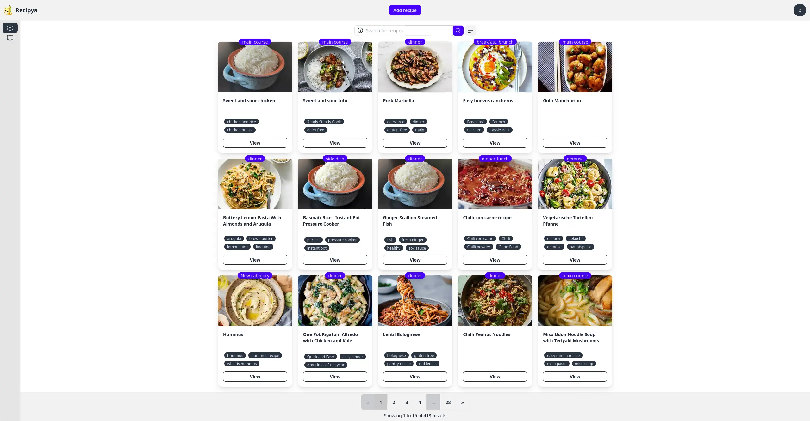

# Recipya Rust &emsp; [![Build Status]][actions] [![Latest Version]][version] [![Contributions]][contributions]

[Build Status]: https://img.shields.io/github/actions/workflow/status/serde-rs/serde/ci.yml?branch=master
[actions]: https://github.com/reaper47/recipya-rs/actions/new

[Contributions]: https://img.shields.io/badge/contributions-welcome-brightgreen.svg?style=flat
[contributions]: https://github.com/reaper47/recipya-rs/issues

[Latest Version]: https://img.shields.io/github/v/tag/reaper47/recipya-rs?include_prereleases&label=version
[version]: https://github.com/reaper47/recipya-rs/tags

[Explore the docs](https://recipes.musicavis.ca/guide/docs/) · 
[Demo](https://recipes.musicavis.ca)

## Warning

The [Recipya](https://github.com/reaper47/recipya) project is currently being rewritten in Go as announced [here](https://github.com/reaper47/recipya/discussions/422). The Rust project is not ready for production nor to selfhost. 
The user interface should look exactly the same as the original. 

## Introduction

A clean, simple and powerful recipe manager web application for unforgettable family recipes, empowering you to curate and share your favorite recipes.
It is focused on simplicity for the whole family to enjoy.



## Features

- Manage your favorite recipes
- Import recipes from around the web
- Digitize paper recipes
- Organize your recipes into cookbooks
- Works seamlessly with [Nextcloud Cookbook](https://apps.nextcloud.com/apps/cookbook)
- Automatic conversion to your preferred measurement system (imperial/metric)
- Calculate nutritional information automatically
- Print any recipe in your collection
- Prevent your device from going to sleep while viewing a recipe
- Follows your system's theme (light/dark)
- Cross-compiled for Windows, Linux, and macOS

## Getting Started

### Installation

The installation instructions are written in the [installation section](https://recipes.musicavis.ca/guide/docs/installation/) of the documentation.

### Building the Project

#### Current state

Dependencies:
1. Install rust: https://www.rust-lang.org/
2. Install nodejs to build the frontend: https://nodejs.org/en/download/package-manager
3. Install Task: https://taskfile.dev/installation/
4. Install hugo extended to build the documentation website: https://gohugo.io/installation/
5. PostgreSQL: https://www.postgresql.org/download/
6. Diesel: `cargo install diesel_cli`

To build:
1. Build the docs: `task build-docs`
2. Build the frontend: `task build-web` 
3. Set the environment variables in `.cargo/config.toml`
3. Run recipya: `cargo run -p recipya`

#### Once recipya-rs becomes the defacto Recipya:

Follow these steps to build the project yourself:
1. Clone the project.
   ```bash
   git clone https://github.com/reaper47/recipya-rs.git
   ```
2. Install the required [dependencies](https://recipes.musicavis.ca/guide/docs/development/intro/#dependencies).
3. [Build](https://recipes.musicavis.ca/guide/docs/development/build/) the project.

Alternatively, you may use the [development container](https://recipes.musicavis.ca/guide/docs/development/devcontainer/).
Recipya's Docker [container](https://github.com/reaper47/recipya-rs/tree/main/.devcontainer) includes all the necessary tools and dependencies you need to start writing code quickly. 

## Contributing

Contributions are always welcome! Please open an issue, start a [discussion](https://github.com/reaper47/recipya/discussions), open a pull request or send an email 
at macpoule@gmail.com. The same applies if you have any feedback or need support.

You can also join our development and support channel on the [Matrix space: #recipya:matrix.org](https://app.element.io/#/room/#recipya:matrix.org).
Matrix is similar to Discord but is open source.

## Sponsors

I am grateful for any support that helps me continue to develop this project and to host it reliably. Your sponsorship will 
help me pay for the SendGrid Essentials plan to increase the number of emails that can be sent. The free plan currently 
used allows sending up to 100 emails per day.

You can sponsor me on 
[GitHub Sponsors](https://github.com/sponsors/reaper47) or
[Buy Me a Coffee](https://www.buymeacoffee.com/macpoule).

Your support is greatly appreciated! A third of donations will be sent to the Armed Forces of Ukraine 🇺🇦

This project is supported by these kind people:


## Other Recipe Manager Apps

- [Tandoor](https://github.com/TandoorRecipes/recipes)
- [Mealie](https://github.com/mealie-recipes/mealie)
- [Paprika](https://www.paprikaapp.com/)
- [Grocy](https://grocy.info/)
- [Cooklist](https://cooklist.com/)
- [Grossr](https://grossr.com/)
- [Awesome List](https://github.com/awesome-selfhosted/awesome-selfhosted#recipe-management)

# Inspiration

This project was mainly coded to blasting the following albums:
- [4am](https://www.youtube.com/watch?v=tBcPji_jRDc)
- [Abysmal Dawn - Phylogenesis](https://www.youtube.com/watch?v=xJMybqRMedk&pp=ygUMYWJ5c21hbCBkYXdu)
- [Archspire - Bleed the Future](https://www.youtube.com/watch?v=o8H9ahswldM)
- [Atavistia - Cosmic Warfare](https://www.youtube.com/watch?v=VjJ_zb4RF2E)
- [Beast In Black - Dark Connection](https://www.youtube.com/watch?v=7NyON-NzBr4)
- [Cattle Decapitation - Terrasite](https://www.youtube.com/watch?v=x6rEDMqM36I)
- [Ensiferum - From Afar](https://www.youtube.com/watch?v=6r8OPu3SRSM)
- [Lofi Girl - lofi hip hop radio](https://www.youtube.com/watch?v=jfKfPfyJRdk)
- [Lofi Girl - synthwave radio](https://www.youtube.com/watch?v=4xDzrJKXOOY)
- [Mozart - Requiem Dm](https://www.youtube.com/watch?v=pBGVfwOLU1w0)
- [Necrophobic - In the Twilight Grey](https://www.youtube.com/watch?v=eDFD6YnMid8)
- [Pain - You Only Live Twice](https://www.youtube.com/watch?v=obgCEoLzLs4)
- [Sonata Arctica - Talviyö](https://www.youtube.com/watch?v=x6rEDMqM36I)
- [Wintersun - Wintersun](https://www.youtube.com/watch?v=W0M3HAMus7g&pp=ygUPd2ludGVyc3VuIGFsYnVt)
